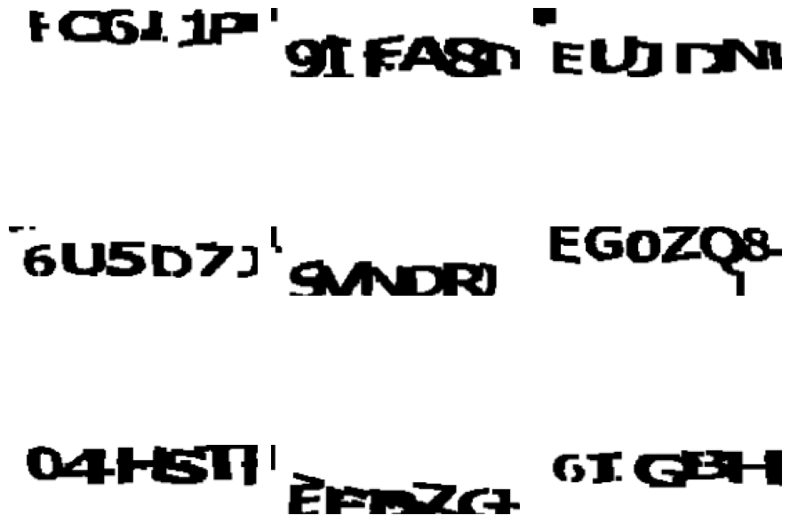
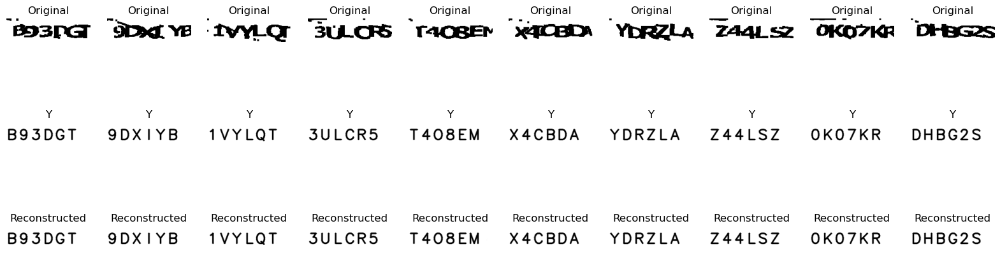

# Captcha-Recognition
This project implements two methods for recognizing each of the six characters in a given CAPTCHA image, as illustrated in the provided example

## Methods
HOG Descriptor with Classifier: The first method uses the Histogram of Oriented Gradients (HOG) descriptor, as discussed in class, combined with a classifier of choice. This approach leverages the feature extraction capabilities of HOG to represent the CAPTCHA characters and a machine learning classifier to identify them.

Convolutional Neural Networks (CNNs): The second method employs Convolutional Neural Networks (CNNs), which are known for their superior performance in image recognition tasks. This method is expected to yield better results due to the powerful feature extraction and classification capabilities of CNNs.

To help the classification, was develop a GenAI technique to create clean images based on the input captcha. This as achieve by using, Autoencoders, U-NET and a conditional U-NET. 

## Results

